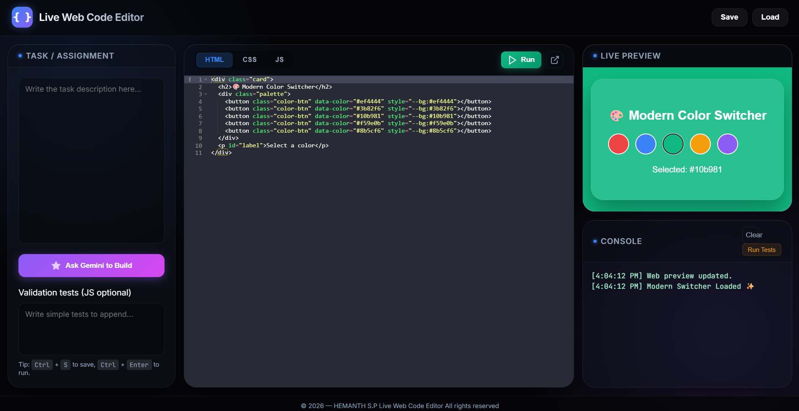

#  Live Web Code Editor (AI-Powered)

[](LICENSE)
[]()

> **A next-gen, AI-powered code editor for the modern web.**  
> Write HTML, CSS, and JavaScript with a premium Glassmorphism UI, real-time preview, and **Magic Build** generative AI.

---
## 📸 Demo



---
## 🚀 Key Features

### 🎨 Visuals & Layout

- **Glassmorphism 2.0**: Deep space aesthetic with frosted glass panels, neon accents, and smooth animations.
- **Bento Grid**: Responsive, dashboard-style grid layout that adapts perfectly to any screen size.
- **Smart Panels**: Distinct areas for Task, Editors, Preview, and Console.

### 🤖 Gemini AI Integration ("Magic Build")

- **Generate Code instantly**: Type a request like _"A spinning 3D cube"_ and watch it build itself.
- **Multi-Model Support**: Automatically falls back between `gemini-2.0-flash`, `1.5-flash`, and `gemini-pro` to ensure reliability.
- **OpenRouter Compatible**: Use your OpenAI/Anthropic keys via OpenRouter or direct Google AI Studio keys.
- **Resilient**: Smart handling of rate limits (429) and errors.

### 🛠 Core Tools

- **Tabbed Editing**: Switch between HTML, CSS, and JS.
- **Live Preview**: Sandboxed execution with console output capturing.
- **Persistence**: Auto-saves to `localStorage` and supports JSON import/export.
- **Validation**: Built-in test runner for assignments.

---


## �‍🏫 Quick Start

1.  **Open**: Launch `index.html` in any modern browser.
2.  **Code**: Start typing in the Ace Editor panels.
3.  **Run**: Press `Ctrl + Enter` to update the preview manually.
4.  **Magic Build**:
    - Click **"Ask Gemini to Build"**.
    - Enter your API Key (saved securely).
    - Describe what you want!

---

## 📂 Folder Structure

```text
live-code-editor/
├── index.html         # Main application structure (Bento Grid)
├── style.css          # Glassmorphism theme & animations
├── script.js          # Logic, AI integration, and Preview engine
└── README.md          # Documentation
```

## 🔐 API Key Privacy

Your API keys are stored **locally** in your browser's `localStorage` (`gemini_api_key`). They are never sent to any server other than the AI provider (Google or OpenRouter).

---

## 📄 License

This project is open-source and available under the MIT License.

© 2026 — HEMANTH S.P Live Web Code Editor. All rights reserved.
